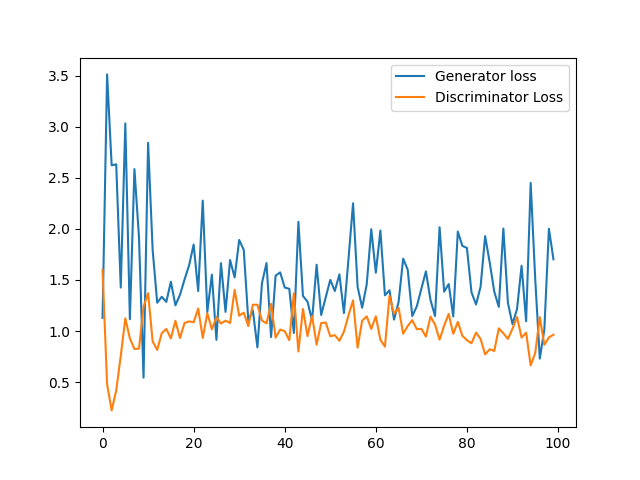
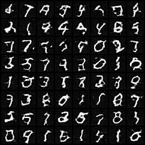
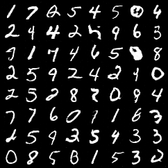
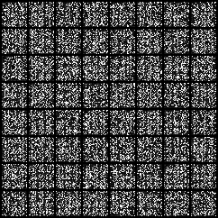

# Generative Adversarial Network (GAN) for MNIST Dataset in PyTorch

This project implements a Generative Adversarial Network (GAN) using PyTorch framework to generate hand-written digit images based on the MNIST dataset.

## Introduction

The goal of this project is to train a GAN model to generate realistic hand-written digit images. The GAN consists of a generator network and a discriminator network that compete against each other in a minimax game to improve the quality of generated images. The generator network generates synthetic images, while the discriminator network tries to distinguish between real and generated images. Through this adversarial training process, the generator network learns to produce high-quality images that closely resemble the real hand-written digits.

## Background

The MNIST dataset is a widely used benchmark dataset in the field of computer vision. It consists of 60,000 training images and 10,000 test images of hand-written digits (0-9), each represented as a grayscale image of size 28x28 pixels.

## Methodology

1. **Data Preparation:** The MNIST dataset is downloaded and preprocessed using PyTorch's torchvision library. The images are resized to 28x28 pixels, converted to tensors, and normalized.

2. **Architecture:** The GAN architecture comprises a generator network and a discriminator network. The generator network takes random noise as input and gradually upsamples it to generate synthetic images. The discriminator network receives either real or generated images and learns to classify them as real or fake.

3. **Training:** The GAN is trained through a series of epochs. In each epoch, the discriminator is trained on both real and generated images, while the generator is trained to fool the discriminator. The training process involves forward and backward passes, calculating losses, and updating the network parameters using Adam optimizer.

4. **Results:** The project records the generator and discriminator losses after each epoch. Additionally, it saves sample images generated by the generator network during the training process. The results showcase the improvement in image quality over the training epochs.

## Results

**Generator and Discriminator Loss:** The plot below illustrates the generator and discriminator losses over the 20 epochs of training.

**Generated Images:** The project generates hand-written digit images that closely resemble the real MNIST digits. The two images below depict a sample generated image from the early epochs and a sample generated image from the final epochs.

Sample Generated Image from Early Epochs:

Sample Generated Image from Final Epochs:

**Generated Images GIF:** The GIF below shows the progression of generated images over the training epochs.

## Usage

1. Clone the repository:

git clone https://github.com/noahweiss890/MNIST-GAN-PyTorch.git

2. Run the script:

python gan_mnist.py
